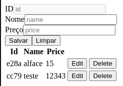

# Pensar e Responder 10

## Índice

- [Sobre o Projeto](#sobre-o-projeto)
- [Funcionalidades do Projeto](#funcionalidades-do-projeto)
- [Instalando o Projeto](#instalando-o-projeto)
- [Rotas do Projeto](#rotas-do-projeto)
- [Exemplo](#exemplo)

## Sobre o Projeto

Este projeto foi desenvolvido para entrega de parcial numero 10 da faculdade descomplica.

## Funcionalidades do Projeto

- Listagem de itens
- Criação de item
- Edição de item
- Deleção de item

### Instalando o Projeto

Instale todas as dependencias necessárias para rodar o projeto

```
npm install
```

Rode o Projeto

```
npm start
```


### Rotas do projeto

este projeto conta apenas com a rota principal para visualização de lista tendo
seus dados passados por meio de services e relacionamentos entre componentes

## Exemplo

